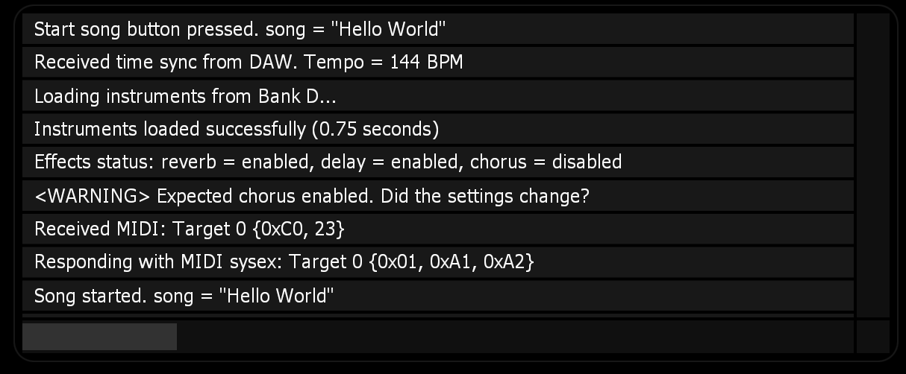
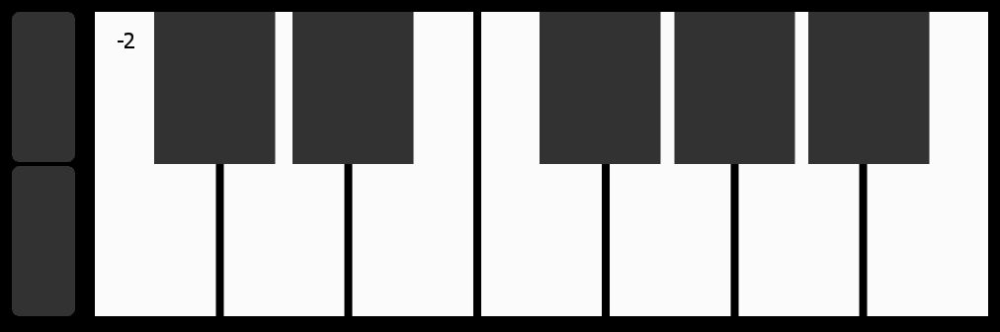
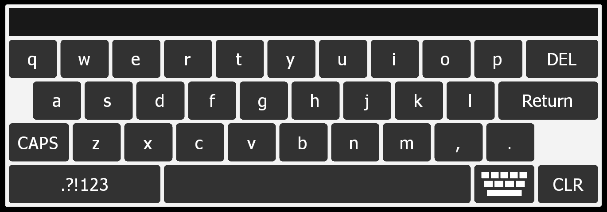

# Lemur Changelog

## Lemur 5.6

Nov 4, 2024

## Script Editor Improvements

- Undo/Redo

The most requested feature! You can now undo changes in the script editor. Each script maintains its own separate undo history. This ensures that undoing changes in one script won’t affect another. Additionally, undo actions are tracked separately for UI and script editor changes, ensuring undo actions remain specific to where they occurred.

- Comment/Uncomment Selection

Use the keyboard shortcut  `CMD/CTL + \` to toggle code comments on/off. Works on both single and multiple lines.


- Tab-Indent Selection

Use the keyboard shorcut `CMD/CTL [ or ]` to tab-indent code. Works on both single and multiple lines.


### Improvements to Lemur Editor

- Updated Lemur default project sizes to reflect modern iOS devices

	- iPad 9.7"
	- iPad 10.2"
	- iPad 10.9"
	- iPad 12.9"


## Additions to LemurLang

#### String Functions

Lemur 5.6 implements important text functions, completing the essential infrastructure for full text processing in LemurLang. 

- `stringtoarray(s)`

Returns an array of ANSI-encoded characters for a given string or 0 if the conversion fails.

```
stringtoarray('Hello'); // {72, 101, 108, 108, 111}
stringtoarray(MyButton); // 0
```

You can now easily perform tasks like sending text as SysEx messages:

```
// Sends the message 'Start Song' as sysex data to Lemur Target 0
sysexout(0, stringtoarray('Start Song'));
```

Or, perhaps apply auto-capilization rules:

```
decl lowercase = 'hello';
decl uppercase = arraytostring(stringtoarray(lowercase) - 32); // 'HELLO';
```

For a reference of ANSI-encoded characters, see [this link](https://www.ascii-code.com). 

- `stringtonumber(s)`

Returns a string converted to a number, or the empty string if conversion failed.

```
stringtonumber(100); // 100
stringtonumber('hello'); // ''
```

#### MIDI Related Functions

Lemur 5.6 implements new convenience methods for sending different MIDI messages, which previously required manually sending them as raw MIDI bytes.

    
- `programchangeout(target, pgm, chan)`

    Sends a MIDI program change message out Lemur target `target`, with data-byte 1 `pgm`, on MIDI channel `chan`.
    
- `channelpressureout(target, pressure, chan)`

    Sends a MIDI channel pressure message out Lemur target `target`with data-byte 1 `pressure`, on MIDI channel `chan`.
    
- `polypressureout(target, note, pressure, chan)`

    Sends a MIDI poly pressure message out Lemur target `target` with data-byte 1 `note` and data-byte 2 `pressure` on MIDI channel `chan`.
    
- `pitchbendout(target, value, min, max, chan)`

    Sends a MIDI pitchbend message on Lemur target `target`, with value `value`, where `value` represents a value in the range of `min` and `max` on MIDI channel `chan`.
    
    Common ranges for `min` and `max`:
    
    - `min` = 0, `max` = 1 (center = 0.5)

        Useful for Lemur fader widgets who specify their position as a floating point number between 0 and 1. The center is at 0.5.
        
        Example:
        
        `pitchbendout(0, Fader.x, 0, 1, 1)`
    
    - `min` = -1, `max` = 1 (center = 0)
    - `min` = 0, `max` = 16383 (center = 8192)
    - `min` = -8192, `max` = 8191 (center = 0)

- `sysexout(target, databytes[])`

    Sends a MIDI sysex message out Lemur target `target` with the supplied `dataBytes`. 
    
    Note:
    - You do not need to specify the sysex-start or sysex-end data bytes. These will be added to the message before it is sent if they are not already added.
    - Data bytes are currently limited to 128 values.

    Example:
    
    ```
    sysexout(0, {0, 0, 11, 12});
    ```

## Bug Fixes

- Fixed an issue with the Image Widget resizing unexpectedly when Resize Mode is set to Lock Ratio.
- Fixed the Lemur Editor window becoming unreachable on multi-monitor setups.


## Downloadable Lemur Modules

### MKConsole

A text console for logging debug messages.



Features:

- Auto-resizes.
- Double-tap to clear, or clear programmatically. 
- Customize colors and font sizes.

[Download Here](https://github.com/MIDIKinetics/MKConsole)

--- 

### MKPiano

A fully customizable, 128 key piano widget.



Features:

- Auto-resizes 
- Respond to key presses and releases.
- The higher you tap on the key the greater the velocity.
- Adjustable number of visible octaves.
- Configurable scrolling behavior (octave or page-based).
- Option to show/hide/reposition scroll buttons.
- Disable scrolling animations.
- Add custom labels to each key and control text color.
- Customize key colors.
- Enable full programmatic control by disabling key presses.

[Download Here](https://github.com/MIDIKinetics/MKPiano)

--- 

### MKQwerty

Add a QWERTY keyboard to your Lemur project to enable in-app text editing.



Features:

- Auto-resizes.
- Choose between alphanumeric or numeric output.
- Limit input to integers, floats, or positive numbers.
- Show/Hide Return key.
- Show/Hide Dismiss key.
- Show/Hide output display.
- Monitor output and keystrokes.
- Set input programmatically.
- Customizable colors and text size


[Download Here](https://github.com/MIDIKinetics/MKQwerty)

